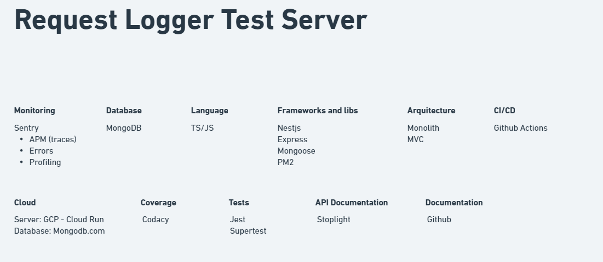

# request-logger-test
[](https://app.codacy.com/gh/Rafaeldsb/request-logger-test/dashboard?utm_source=gh&utm_medium=referral&utm_content=&utm_campaign=Badge_grade)
[](https://app.codacy.com/gh/Rafaeldsb/request-logger-test/dashboard?utm_source=gh&utm_medium=referral&utm_content=&utm_campaign=Badge_coverage)

# Documentation
**API Docs**: https://rafael-dsb.stoplight.io/docs/request-logger/branches/main/d64oqw1kq2kd1-request-logger-test

**Architecture Docs**:  https://whimsical.com/request-logger-test-867g42awzqSxD9hhrhgmt6@7YNFXnKbYn8S1mpfLepg9

# Architecture

## Technologies
Summary of Technologies Used in the Application Architecture:

**Nest.js**: Nest.js was utilized as the backend framework, providing a modular and scalable structure for building APIs and microservices.

**Jest**: Jest served as the testing framework, enabling the creation of unit and integration tests to ensure code reliability and quality.

**Docker**: Used to create containerized environments for the application.

**Docker-compose** (Local Development): Streamlined local development by managing multi-container applications, like the application and mongodb.

**Cloud Run**: Google Cloud Run was utilized as the serverless compute platform, facilitating automatic scaling and easy deployment of containerized applications.

**MongoDB**: MongoDB serverless was chosen as the NoSQL database solution, providing flexibility and scalability for data storage and retrieval.

**Sentry**: Integrated for real-time error monitoring and tracking to identify and resolve issues promptly.

**Stoplight**: Stoplight was used for API design and documentation, streamlining the process of creating, testing, and documenting APIs efficiently.

These technologies collectively contribute to the robust and efficient architecture of the application.



# How to run?

## How to Start Client Runner
Before getting started with Client Runner, ensure that you have Node.js installed on your machine.

Follow these steps to set up Client Runner:
```sh
npm install -g pm2
pm2 start ./scripts/logger-runner.js

pm2 startup
```

Running `pm2 startup` will provide a command for you to execute.

Next, perform the following:
```sh
pm2 save
```

Now, the process will run automatically when the operating system boots up.

## How To Start the Web Server

To begin, make a copy of the `.env-local` file using the following command:
```sh
cp .env-local .env
```
This file already contains all the necessary configurations to run the application smoothly.

Now, you can launch the application using Docker Compose:
```sh
docker-compose up
```
By following these steps, you'll have the web server up and running.

